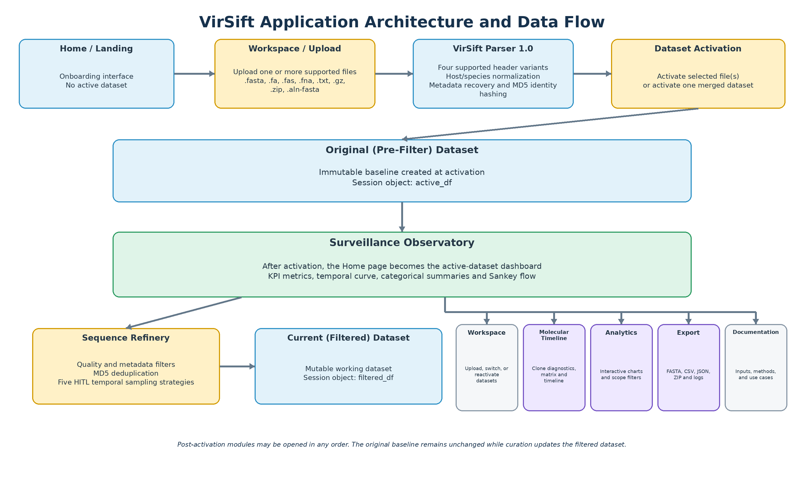
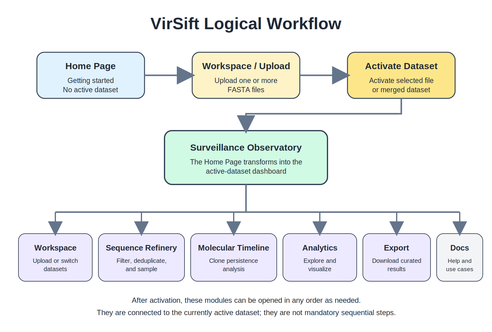
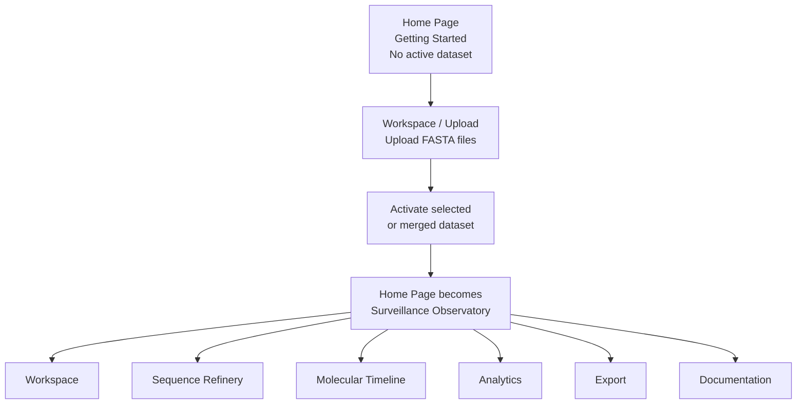

<p align="center">
  
</p>

<h1 align="center">VirSift</h1>

<p align="center">
  <strong>A structured, multilingual, browser-based workflow for pre-phylogenetic viral FASTA curation across human and non-human animal hosts</strong>
</p>

<p align="center">
  
  
  
  
  
  
</p>

<p align="center">
  <a href="https://virsift.streamlit.app/">Live App</a> ·
  <a href="#citation">Citation</a> ·
  <a href="#quick-start">Quick Start</a> ·
  <a href="#features-at-a-glance">Features</a> ·
  <a href="#architecture">Architecture</a> ·
  <a href="#screenshots">Screenshots</a>
</p>

---

## Overview

**VirSift** is a seven-page Streamlit application for pre-phylogenetic curation and exploration of viral FASTA datasets from human and non-human animal hosts. It supports influenza A, B, C, and D, respiratory syncytial virus (RSV), SARS-CoV-2, and other viral datasets whose FASTA headers and metadata are compatible with the parser.

VirSift brings parsing, filtering, deduplication, human-in-the-loop temporal sampling, visualization, molecular persistence analysis, and structured export into one browser-based workflow.

It is designed for virologists, surveillance laboratories, bioinformaticians, epidemiologists, researchers, and instructors who need a reproducible way to prepare viral sequence datasets before alignment, phylogenetic reconstruction, or other downstream analyses.

### Core capabilities

- Parse multiple FASTA and compressed archive formats.
- Interpret supported GISAID-style and NCBI/GenBank-compatible header structures.
- Infer host, normalize species names, extract clade and segment metadata, and calculate MD5 hashes.
- Preserve an immutable pre-filter dataset alongside a mutable curated dataset.
- Apply sequence-quality, metadata, accession, and deduplication filters.
- Run five human-in-the-loop temporal sampling strategies.
- Generate epidemiological, temporal, categorical, and hierarchical visualizations.
- Track molecular clone persistence through a dedicated timeline workflow.
- Export curated data as FASTA, CSV, JSON, session logs, accession lists, and segment-organized ZIP bundles.
- Provide six structurally aligned language catalogues containing 817 keys each.

---

## Citation

GitHub-compatible citation metadata are provided in [`CITATION.cff`](CITATION.cff).

When using VirSift in research, reports, surveillance workflows, teaching, or publications, please cite:

> Alabetutu, A., Sobolev, I. A., Adeluwoye, A. O., & Shestopalov, A. M. (2026). *VirSift: A structured, multilingual, browser-based workflow for pre-phylogenetic curation and epidemiological visualization of viral sequence datasets from human and non-human animal hosts* (Version 1.0.0). DOI pending.

### BibTeX

```bibtex
@software{alabetutu_virsift_2026,
  author  = {Alabetutu, Ayanfeoluwa and Sobolev, Ivan A. and Adeluwoye, Adekunle O. and Shestopalov, Alexander M.},
  title   = {VirSift: A Structured, Multilingual, Browser-Based Workflow for Pre-Phylogenetic Curation and Epidemiological Visualization of Viral Sequence Datasets from Human and Non-Human Animal Hosts},
  year    = {2026},
  version = {1.0.0},
  doi     = {DOI pending},
  url     = {https://github.com/SpatialOmicsLab/virsift}
}
```

After the first Zenodo archive is published, replace the pending DOI in the badge, citation, `CITATION.cff`, and BibTeX entry with the version-specific DOI.

---

## Why VirSift?

Preparing viral sequence datasets often involves a mixture of scripts, spreadsheets, manual header editing, and undocumented exclusion decisions. VirSift consolidates those steps into one visual workflow while preserving the distinction between the original parsed dataset and the current curated dataset.

| Capability | Manual spreadsheet workflow | Typical command-line workflow | VirSift |
|---|:---:|:---:|:---:|
| Browser-based interface | ✓ | — | ✓ |
| Multi-format FASTA/archive input | Limited | ✓ | ✓ |
| Viral header interpretation | Manual | Script-dependent | ✓ |
| Immutable pre-filter baseline | Rare | Pipeline-dependent | ✓ |
| Sequence and metadata filtering | Manual | ✓ | ✓ |
| MD5-based deduplication | Rare | ✓ | ✓ |
| Human-in-the-loop temporal sampling | Manual | Limited | ✓ |
| Integrated visual analytics | Limited | Tool-dependent | ✓ |
| Molecular persistence timeline | — | Custom analysis | ✓ |
| Multilingual interface | — | Rare | ✓ |
| Session-aware export and audit trail | Limited | Pipeline-dependent | ✓ |

> VirSift prepares and documents viral sequence datasets for downstream analysis. It does not perform sequence alignment, model selection, or phylogenetic tree inference.

---

## Features at a Glance

| Module | What it does |
|---|---|
| 📥 **Workspace / Upload** | Accepts FASTA files, text files, gzip files, ZIP archives, and aligned FASTA inputs. |
| 🧬 **VirSift Parser 1.0** | Detects supported viral headers, normalizes metadata, infers host information where available, and computes MD5 hashes. |
| 🧹 **Sequence Refinery** | Applies length, N-run, date, host, subtype, segment, location, accession, and deduplication filters. |
| 👤 **HITL Sampling** | Supports Chronological Sentinel, Highest Volume Peaks, Peak Checklist, Custom Checkpoints, and Visual Lasso strategies. |
| 📊 **Observatory** | Presents KPI summaries, temporal curves, composition views, and Sankey flows. |
| 📈 **Analytics** | Provides ten visualization types, including Sunburst, Treemap, temporal charts, distributions, and monthly heatmaps. |
| 🕒 **Molecular Timeline** | Supports diagnostics, persistence matrices, and Gantt-style clone-persistence timelines. |
| 🌍 **Internationalization** | Uses 817 keys across EN, RU, FR, ES, AR, and ZH, with English fallback where needed. |
| 📦 **Export** | Produces FASTA, metadata CSV, JSON, session logs, accession lists, and segment-organized ZIP bundles. |

---

## Supported Viral Workflows

VirSift supports viral FASTA workflows involving viruses collected from both human and non-human animal hosts, including:

- Influenza A, B, C, and D from human, avian, swine, equine, bovine, and other compatible host records
- Respiratory syncytial virus (RSV) from human and animal hosts
- SARS-CoV-2 and other coronaviruses with compatible FASTA headers and metadata
- Other viral datasets whose header structures and metadata are compatible with VirSift Parser 1.0

For compatible records, VirSift can recover available metadata such as host, host species, subtype, segment, clade, accession, collection date, and location. Host information may also be inferred from isolate names when the required information is present.

---

## Architecture

The application separates the immutable dataset produced immediately after parsing from the mutable dataset produced through filtering and sampling. This protects the original baseline while allowing iterative curation of the active working dataset.

<p align="center">
  
</p>

### Logical Workflow

VirSift begins in a pre-activation state. The Home page introduces the platform and directs users to **Workspace** to upload FASTA files. After a selected or merged dataset is activated, the Home page becomes the **Surveillance Observatory**.

<p align="center">
  
</p>



After activation, users may open **Workspace**, **Sequence Refinery**, **Molecular Timeline**, **Analytics**, **Export**, or **Documentation** in any order. These modules share the currently active dataset but do not form a compulsory linear sequence.

---

## Supported Inputs

VirSift accepts:

```text
.fasta
.fa
.fas
.fna
.txt
.gz
.fasta.gz
.zip
.aln-fasta
```

---

## Quality and Metadata Filtering

VirSift supports:

- Minimum sequence length
- Maximum ambiguous-base or N-run threshold
- Collection-date range
- Host filtering
- Subtype filtering
- Segment filtering
- Location filtering
- Accession-based inclusion or exclusion
- MD5-based exact-sequence deduplication

The **Original (Pre-Filter) Dataset** remains unchanged after parsing. Filters operate on the **Current (Filtered) Dataset**, which can be refined iteratively.

---

## Human-in-the-Loop Temporal Sampling

VirSift includes five sampling strategies:

1. **Chronological Sentinel** — selects representative records across time.
2. **Highest Volume Peaks** — prioritizes periods with the largest sequence volume.
3. **Peak Checklist** — lets users confirm candidate sampling peaks.
4. **Custom Checkpoints** — samples user-defined temporal positions.
5. **Visual Lasso** — supports interactive chart-based selection.

---

## Visualization Suite

The visualization layer includes:

- Sunburst charts
- Treemaps
- Gantt timelines
- Sankey flows with up to five levels
- Temporal sequence-record curves
- Host distributions
- Subtype distributions
- Clade distributions
- Other categorical distributions
- Monthly heatmaps

> VirSift charts summarize the sequence records present in the active uploaded dataset. They are not epidemiological case counts, incidence, or prevalence estimates.

---

## Molecular Timeline Tracker

The Molecular Timeline module provides a four-phase workflow for examining molecular clone persistence. Outputs include:

- Diagnostic summaries
- Persistence matrices
- Gantt-style temporal timelines
- Curated sequence and metadata exports

---

## Multilingual Architecture

Each language catalogue contains the same **817 keys**:

- English (`EN`)
- Russian (`RU`)
- French (`FR`)
- Spanish (`ES`)
- Arabic (`AR`)
- Chinese (`ZH`)

English and Russian provide complete native-language coverage. French, Spanish, Arabic, and Chinese are structurally complete and retain English source text for values awaiting reviewed native-language completion.

---

## Quick Start

### Requirements

- Python 3.11 or newer
- `pip`
- A modern web browser

### 1. Clone the repository

```bash
git clone https://github.com/SpatialOmicsLab/virsift.git
cd virsift
```

### 2. Create and activate a virtual environment

#### Windows PowerShell

```powershell
python -m venv .venv
.venv\Scripts\Activate.ps1
```

#### macOS or Linux

```bash
python3 -m venv .venv
source .venv/bin/activate
```

### 3. Install dependencies

```bash
python -m pip install --upgrade pip
pip install -r requirements.txt
```

### 4. Launch VirSift

```bash
streamlit run app.py
```

Open the local URL displayed by Streamlit, normally:

```text
http://localhost:8501
```

---

## Typical Usage

1. Upload one or more FASTA files or a supported archive.
2. Review parser output and activate the selected or merged dataset.
3. Apply sequence-quality and metadata filters.
4. Remove exact duplicate sequences where appropriate.
5. Select a HITL temporal sampling strategy.
6. Explore Observatory and Analytics outputs.
7. Run Molecular Timeline analysis when persistence analysis is required.
8. Export the curated dataset and session records.

---

## Live Application

<p align="center">
  <a href="https://virsift.streamlit.app/"><strong>Open VirSift on Streamlit Community Cloud</strong></a>
</p>

Use data appropriate for the deployment environment.

---

## Screenshots

The previews below are optimized for the README. Select any image to open the full-resolution screenshot or readable multi-panel overview.

<table>
  <tr>
    <td width="50%" valign="top">
      <strong>Landing Page</strong><br>
      <a href="docs/screenshots/full/01-landing.png">
        
      </a>
      <br>
      Entry point showing the workflow, platform capabilities, supported inputs, supported viruses, and quick-start guidance.
    </td>
    <td width="50%" valign="top">
      <strong>Surveillance Observatory</strong><br>
      <a href="docs/screenshots/full/02-observatory.png">
        
      </a>
      <br>
      KPIs, temporal summaries, composition views, Sankey flow, and batch-source audit.
    </td>
  </tr>
  <tr>
    <td width="50%" valign="top">
      <strong>Workspace and Dataset Activation</strong><br>
      <a href="docs/screenshots/full/03-workspace.png">
        
      </a>
      <br>
      Multi-file upload, source-level statistics, activation, merging, and active-dataset summaries.
    </td>
    <td width="50%" valign="top">
      <strong>Sequence Refinery</strong><br>
      <a href="docs/screenshots/full/04-sequence-refinery.png">
        
      </a>
      <br>
      Quality controls, metadata rules, accession filtering, deduplication, and HITL sampling.
    </td>
  </tr>
  <tr>
    <td width="50%" valign="top">
      <strong>Molecular Timeline</strong><br>
      <a href="docs/screenshots/full/05-molecular-timeline.png">
        
      </a>
      <br>
      Diagnostics, configuration, persistence-matrix review, timeline visualization, and export.
    </td>
    <td width="50%" valign="top">
      <strong>Analytics Dashboard</strong><br>
      <a href="docs/screenshots/full/06-analytics.png">
        
      </a>
      <br>
      Scope-aware filtering, overview gauges, chart configuration, palettes, and example output.
    </td>
  </tr>
  <tr>
    <td width="50%" valign="top">
      <strong>Export and Reports</strong><br>
      <a href="docs/screenshots/full/07-export.png">
        
      </a>
      <br>
      Quick downloads, metadata splitting, segment-folder output, accessions, and session logs.
    </td>
    <td width="50%" valign="top">
      <strong>Documentation and Use-Case Library</strong><br>
      <a href="docs/screenshots/full/08-documentation.png">
        
      </a>
      <br>
      Quick-start guidance, feature documentation, FAQs, FASTA-header help, and 76 use cases.
    </td>
  </tr>
</table>

<details>
<summary><strong>Open the complete full-resolution screenshot list</strong></summary>

- [Landing Page](docs/screenshots/full/01-landing.png)
- [Surveillance Observatory](docs/screenshots/full/02-observatory.png)
- [Workspace and Dataset Activation](docs/screenshots/full/03-workspace.png)
- [Sequence Refinery](docs/screenshots/full/04-sequence-refinery.png)
- [Molecular Timeline](docs/screenshots/full/05-molecular-timeline.png)
- [Analytics Dashboard](docs/screenshots/full/06-analytics.png)
- [Export and Reports](docs/screenshots/full/07-export.png)
- [Documentation and Use-Case Library](docs/screenshots/full/08-documentation.png)

</details>

---

## Example and Test Datasets

The [`cases/`](cases/) directory contains software use cases and test inputs for upload, parsing, filtering, visualization, timeline analysis, and export workflows.

| File | Intended use |
|---|---|
| `All H3N2_20250918_070704.fasta` | Example H3N2 dataset for upload, parsing, filtering, and visualization. |
| `HA_test_copy1.fasta` | Compact HA test dataset for parser, filtering, deduplication, and analytics checks. |
| `RSV-B_for_filtration.fasta` | RSV-B test dataset for sequence-quality filtering and non-influenza workflow checks. |
| `usecase.md` | Repository-based usage notes and test-case guidance. |

---

## Data Sources and Interpretation

VirSift supports data obtained from GISAID, NCBI/GenBank, and other sources. Users are responsible for following the access, acknowledgement, privacy, and redistribution terms that apply to their datasets.

For detailed wording, see:

- [`DATA_SOURCES_AND_COMPLIANCE.md`](DATA_SOURCES_AND_COMPLIANCE.md)
- [`DISCLAIMER.md`](DISCLAIMER.md)
- [`docs/APP_FOOTER_DISCLAIMER.md`](docs/APP_FOOTER_DISCLAIMER.md)

---

## Limitations

VirSift:

- Does not perform sequence alignment or phylogenetic tree inference.
- Does not establish biological relatedness from MD5 identity alone.
- Does not convert sequence-record counts into epidemiological case counts.
- Depends on the quality and consistency of uploaded headers and metadata.
- May be constrained by available memory and hosting limits for very large datasets.
- Requires domain-expert interpretation for surveillance or publication use.

---

## Reproducibility

To reproduce a VirSift session, retain:

- The original input dataset
- The exported curated dataset
- The session log
- Applied filter settings
- Sampling-strategy details
- Software version information

---

## Roadmap

Planned development may include:

- Expanded automated test coverage
- Additional viral metadata schemas
- Improved reproducibility snapshots and session restoration
- More export presets and provenance reporting
- Accessibility and right-to-left interface improvements
- Performance profiling for larger datasets
- Additional documentation and teaching datasets

---

## Contributing and Support

Bug reports, feature proposals, translation improvements, tests, and documentation contributions are welcome.

- Use [GitHub Issues](https://github.com/SpatialOmicsLab/virsift/issues) for public bug reports and feature proposals.
- Read [`CONTRIBUTING.md`](CONTRIBUTING.md) before submitting code or documentation.
- Participation is governed by [`CODE_OF_CONDUCT.md`](CODE_OF_CONDUCT.md).
- For questions that should not be discussed publicly, contact [ayanfe4luv@gmail.com](mailto:ayanfe4luv@gmail.com).

---

## License

VirSift is released under the **MIT License**. Copyright © 2026 Ayanfeoluwa Alabetutu. See [`LICENSE`](LICENSE) for details.

---

## Contact

**Ayanfeoluwa Alabetutu**  
Corresponding author  
Email: [ayanfe4luv@gmail.com](mailto:ayanfe4luv@gmail.com)

---

<p align="center">
  <strong>VirSift v1.0.0 · 2026</strong>
</p>
