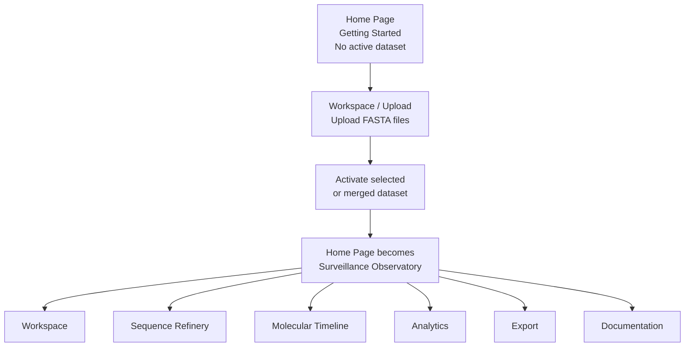

<p align="center">
  
</p>

<h1 align="center">VirSift</h1>

<p align="center">
  <strong>A structured, multilingual, browser-based workflow for pre-phylogenetic curation and epidemiological visualization of GISAID and NCBI/GenBank influenza sequence datasets</strong>
</p>

<p align="center">
  
  
  
  
  
  
</p>

<p align="center">
  <a href="https://virsift.streamlit.app/">Live App</a> ·
  <a href="#quick-start">Quick Start</a> ·
  <a href="#features-at-a-glance">Features</a> ·
  <a href="#architecture">Architecture</a> ·
  <a href="#screenshots">Screenshots</a> ·
  <a href="#citation">Citation</a>
</p>

---

## Overview

**VirSift** is a seven-page Streamlit application for the pre-phylogenetic curation of influenza A and B sequence datasets obtained from GISAID and NCBI. It provides a complete browser-based workflow for parsing, filtering, temporal sampling, epidemiological visualization, molecular persistence analysis, and structured export—without requiring users to work directly from the command line.

VirSift is designed for field virologists, surveillance laboratories, bioinformaticians, and epidemiologists who need a reproducible and auditable way to prepare sequence datasets before alignment, phylogenetic reconstruction, or downstream genomic surveillance.

### Core capabilities

- Parse multiple FASTA and compressed archive formats.
- Interpret four common GISAID/NCBI header variants.
- Infer host, normalize species names, extract clade and segment metadata, and calculate MD5 hashes.
- Preserve an immutable pre-filter dataset while maintaining a separate mutable curated dataset.
- Apply vectorized sequence-quality and metadata filters.
- Deduplicate sequences using MD5 identity hashes.
- Run five human-in-the-loop temporal sampling strategies.
- Generate ten epidemiological and temporal visualizations.
- Track molecular clone persistence through a dedicated timeline workflow.
- Export curated data as FASTA, CSV, JSON, session logs, accession lists, and segment-organized ZIP bundles.
- Provide six selectable language catalogues. English and Russian have complete native-language coverage; French, Spanish, Arabic, and Chinese retain partial native translations with English source text or runtime fallback where needed.

---

## Why VirSift?

Preparing influenza datasets for phylogenetic analysis often involves a patchwork of scripts, spreadsheets, manual header editing, and undocumented exclusion decisions. VirSift consolidates those steps into one visual workflow while preserving the distinction between the original parsed dataset and the current curated dataset.

| Capability | Manual spreadsheet workflow | Typical command-line workflow | VirSift |
|---|:---:|:---:|:---:|
| Browser-based interface | ✓ | — | ✓ |
| Multi-format FASTA/archive input | Limited | ✓ | ✓ |
| GISAID/NCBI header interpretation | Manual | Script-dependent | ✓ |
| Immutable pre-filter baseline | Rare | Pipeline-dependent | ✓ |
| Sequence and metadata filtering | Manual | ✓ | ✓ |
| MD5-based deduplication | Rare | ✓ | ✓ |
| Human-in-the-loop temporal sampling | Manual | Limited | ✓ |
| Integrated epidemiological charts | Limited | Tool-dependent | ✓ |
| Molecular persistence timeline | — | Custom analysis | ✓ |
| Multilingual interface | — | Rare | ✓ |
| Session-aware export and audit trail | Limited | Pipeline-dependent | ✓ |

> VirSift is a **pre-phylogenetic curation tool**. It prepares and documents sequence datasets for downstream analysis; it does not replace sequence alignment, model selection, phylogenetic inference, or specialist interpretation.

---

## Features at a Glance

| Module | What it does |
|---|---|
| 📥 **Workspace / Upload** | Accepts FASTA files, text files, gzip files, ZIP archives, and aligned FASTA inputs. |
| 🧬 **VirSift Parser 1.0** | Detects supported headers, infers host, normalizes species, extracts clade and segment metadata, and computes MD5 hashes. |
| 🧹 **Sequence Refinery** | Applies length, N-run, date, host, subtype, segment, location, accession, and deduplication filters. |
| 👤 **HITL Sampling** | Supports Chronological Sentinel, Highest Volume Peaks, Peak Checklist, Custom Checkpoints, and Visual Lasso strategies. |
| 📊 **Observatory** | Presents KPI summaries, epidemic curves, and Sankey flows. |
| 📈 **Analytics** | Provides ten visualization types, including Sunburst, Treemap, temporal charts, distributions, and monthly heatmaps. |
| 🕒 **Molecular Timeline** | Supports diagnostics, persistence matrices, and Gantt-style clone persistence timelines. |
| 🌍 **Internationalization** | Uses 817 translation keys across EN, RU, FR, ES, AR, and ZH, with English fallback. |
| 📦 **Export** | Produces FASTA, metadata CSV, JSON, session logs, accession lists, and segment-organized ZIP bundles. |

---

## Architecture

The application separates the immutable dataset produced immediately after parsing from the mutable dataset produced through filtering and sampling. This protects the original baseline while allowing users to iteratively curate the active working dataset.

<p align="center">
  
</p>

### Logical Workflow

VirSift begins in a **pre-activation state**. The initial Home Page introduces the platform and directs users to **Workspace** to upload FASTA files. Once a selected or merged dataset is activated, the Home Page automatically becomes the **Surveillance Observatory**.

<p align="center">
  
</p>



After activation, users may open **Workspace**, **Sequence Refinery**, **Molecular Timeline**, **Analytics**, **Export**, or **Documentation** in any order required by the analysis. These pages are connected to the currently active dataset and do not form a compulsory linear sequence.

**Sequence Refinery** contains quality filtering, metadata filtering, MD5 deduplication, and HITL temporal sampling. **Observatory** acts as the active surveillance dashboard and the central starting point for dataset-aware navigation.

---

## Supported Inputs

VirSift accepts the following input extensions:

```text
.fasta
.fa
.fas
.fna
.txt
.gz
.fasta.gz
.zip
.aln-fasta
```

Input records may use any of the four supported GISAID/NCBI header variants recognized by VirSift Parser 1.0.

---

## Quality and Metadata Filtering

VirSift supports:

- Minimum sequence length
- Maximum ambiguous-base or N-run threshold
- Collection-date range
- Host filtering
- Subtype filtering
- Segment filtering
- Location filtering
- Accession-based inclusion or exclusion
- MD5-based sequence deduplication

The **Original (Pre-Filter) Dataset** is created once after parsing and remains unchanged. Filters operate on the **Current (Filtered) Dataset**, which can be refined iteratively.

---

## Human-in-the-Loop Temporal Sampling

VirSift includes five documented sampling strategies:

1. **Chronological Sentinel** — selects representative records across time.
2. **Highest Volume Peaks** — prioritizes periods with the largest sequence volume.
3. **Peak Checklist** — lets users confirm candidate sampling peaks.
4. **Custom Checkpoints** — samples user-defined temporal positions.
5. **Visual Lasso** — supports interactive chart-based selection.

These strategies are intended to keep expert judgment visible and auditable during dataset reduction.

---

## Visualization Suite

The visualization layer includes ten chart types, such as:

- Sunburst charts
- Treemaps
- Gantt timelines
- Sankey flows with up to five levels
- Epidemic curves
- Host distributions
- Subtype distributions
- Clade distributions
- Temporal charts
- Monthly heatmaps

---


> **Interpretation note:** VirSift charts summarize the sequence records present in the active uploaded dataset. They do not represent epidemiological case counts, incidence, prevalence, transmission rates, or a complete population-level surveillance picture.

---

## Molecular Timeline Tracker

The Molecular Timeline module provides a four-phase workflow for examining molecular clone persistence. Its outputs include:

- Diagnostic summaries
- Persistence matrices
- Gantt-style temporal timelines

This module helps users inspect how identical or related sequence identities persist across collection periods and metadata strata.

---

## Multilingual Architecture

Each of the six VirSift translation catalogues contains the same **817 keys**:

- English (`EN`)
- Russian (`RU`)
- French (`FR`)
- Spanish (`ES`)
- Arabic (`AR`)
- Chinese (`ZH`)

English and Russian provide complete native-language coverage. French, Spanish,
Arabic, and Chinese are structurally complete but retain English source text for
some values pending reviewed native-language completion. Runtime English fallback
remains available when a key is absent.

---

## Quick Start

### Requirements

- Python 3.11 or newer
- `pip`
- A modern web browser

### 1. Clone the repository

```bash
git clone https://github.com/SpatialOmicsLab/virsift.git
cd virsift
```

### 2. Create and activate a virtual environment

#### Windows PowerShell

```powershell
python -m venv .venv
.venv\Scripts\Activate.ps1
```

#### macOS or Linux

```bash
python3 -m venv .venv
source .venv/bin/activate
```

### 3. Install dependencies

```bash
python -m pip install --upgrade pip
pip install -r requirements.txt
```

### 4. Launch VirSift

```bash
streamlit run app.py
```

Open the local URL displayed by Streamlit, normally:

```text
http://localhost:8501
```

---

## Typical Usage

1. Upload a FASTA file or supported archive.
2. Review parser output and activate the dataset.
3. Confirm the immutable original dataset.
4. Apply sequence-quality and metadata filters.
5. Remove MD5-identical duplicates where appropriate.
6. Select a HITL temporal sampling strategy.
7. Explore Observatory and Analytics outputs.
8. Run Molecular Timeline analysis.
9. Export the curated dataset and session records.

---

## Live Application

<p align="center">
  <a href="https://virsift.streamlit.app/"><strong>Open VirSift on Streamlit Community Cloud</strong></a>
</p>

The public deployment is suitable for software demonstration and non-sensitive
test data. Restricted, confidential, or sensitive datasets should only be used
in a deployment whose security and data-handling arrangements are appropriate.

---

## Screenshots

The previews below are optimized for the README. Select any image to open the
full-resolution screenshot or readable multi-panel overview.

<table>
  <tr>
    <td width="50%" valign="top">
      <strong>Landing Page</strong><br>
      <a href="docs/screenshots/full/01-landing.png">
        
      </a>
      <br>
      Entry point showing the workflow, platform capabilities, supported inputs,
      supported viruses, and quick-start guidance.
    </td>
    <td width="50%" valign="top">
      <strong>Surveillance Observatory</strong><br>
      <a href="docs/screenshots/full/02-observatory.png">
        
      </a>
      <br>
      KPIs, temporal summaries, composition views, Sankey flow, and batch-source audit.
    </td>
  </tr>
  <tr>
    <td width="50%" valign="top">
      <strong>Workspace and Dataset Activation</strong><br>
      <a href="docs/screenshots/full/03-workspace.png">
        
      </a>
      <br>
      Multi-file upload, source-level statistics, activation, merging, and active-dataset summaries.
    </td>
    <td width="50%" valign="top">
      <strong>Sequence Refinery</strong><br>
      <a href="docs/screenshots/full/04-sequence-refinery.png">
        
      </a>
      <br>
      Quality controls, metadata rules, accession filtering, deduplication, and HITL sampling.
    </td>
  </tr>
  <tr>
    <td width="50%" valign="top">
      <strong>Molecular Timeline</strong><br>
      <a href="docs/screenshots/full/05-molecular-timeline.png">
        
      </a>
      <br>
      A readable four-panel overview covering diagnostics, configuration,
      persistence matrix review, timeline visualization, and export.
    </td>
    <td width="50%" valign="top">
      <strong>Analytics Dashboard</strong><br>
      <a href="docs/screenshots/full/06-analytics.png">
        
      </a>
      <br>
      Scope-aware filtering, overview gauges, chart configuration, palettes, and example output.
    </td>
  </tr>
  <tr>
    <td width="50%" valign="top">
      <strong>Export and Reports</strong><br>
      <a href="docs/screenshots/full/07-export.png">
        
      </a>
      <br>
      Quick downloads, metadata splitting, segment-folder output, accessions, and session logs.
    </td>
    <td width="50%" valign="top">
      <strong>Documentation and Use-Case Library</strong><br>
      <a href="docs/screenshots/full/08-documentation.png">
        
      </a>
      <br>
      Quick-start guidance, feature documentation, FAQs, FASTA header help, and 76 use cases.
    </td>
  </tr>
</table>

<details>
<summary><strong>Open the complete full-resolution screenshot list</strong></summary>

- [Landing Page](docs/screenshots/full/01-landing.png)
- [Surveillance Observatory](docs/screenshots/full/02-observatory.png)
- [Workspace and Dataset Activation](docs/screenshots/full/03-workspace.png)
- [Sequence Refinery](docs/screenshots/full/04-sequence-refinery.png)
- [Molecular Timeline](docs/screenshots/full/05-molecular-timeline.png)
- [Analytics Dashboard](docs/screenshots/full/06-analytics.png)
- [Export and Reports](docs/screenshots/full/07-export.png)
- [Documentation and Use-Case Library](docs/screenshots/full/08-documentation.png)

</details>

---

## Example and Test Datasets

VirSift includes sample and test FASTA files in the repository's [`cases/`](cases/) directory:

| File | Intended use |
|---|---|
| `All H3N2_20250918_070704.fasta` | Example H3N2 dataset for upload, parsing, filtering, and visualization workflows. |
| `HA_test_copy1.fasta` | Compact HA test dataset for validating parser, filtering, deduplication, and analytics behavior. |
| `RSV-B_for_filtration.fasta` | RSV-B test dataset for sequence-quality filtering and non-influenza workflow checks. |
| `usecase.md` | Repository-based usage notes and test-case guidance. |

### Try VirSift with a bundled dataset

1. Open **Workspace**.
2. Upload one of the FASTA files from `cases/`.
3. Activate the selected dataset.
4. Apply quality or metadata filters in **Sequence Refinery**.
5. Explore the output in **Observatory**, **Analytics**, or **Molecular Timeline**.
6. Export the curated result.

> The files in `cases/` should be treated as test or demonstration inputs. Confirm that every sequence is suitable for public redistribution before using the repository as a publication archive.


---

## Data Interpretation, Sources, and Compliance

### Interpretation of charts and dashboards

VirSift does **not** provide epidemiological case counts. All dashboards, timelines, distributions, Sankey diagrams, epidemic curves, and other visualizations are calculated only from the sequence records contained in the active uploaded FASTA dataset.

Accordingly, VirSift outputs should be interpreted as a **descriptive representation of the uploaded sequence dataset**, not as a comprehensive summary of real-world incidence, prevalence, transmission, disease burden, or population-level sampling.

Sequence collections may be affected by:

- Uneven geographic or temporal sampling
- Outbreak-driven sequencing intensity
- Differences in laboratory capacity
- Selective submission practices
- Missing or incomplete metadata
- Duplicate or related sequences
- Delays between collection, sequencing, and database submission

### GISAID data

VirSift supports FASTA structures commonly exported from GISAID, but the software does not grant access to GISAID or replace GISAID's terms of use. Users must access GISAID data through an authorized account and comply with the applicable Database Access Agreement, acknowledgment requirements, and restrictions on access, use, and redistribution.

The software distribution should not contain GISAID-derived sequence records unless public redistribution has been expressly authorized. Before publishing a release, repository maintainers should verify every file in [`cases/`](cases/) and remove or replace any record that is not clearly synthetic or independently redistributable.

### NCBI and GenBank data

VirSift also supports NCBI/GenBank-style sequence records. NCBI generally places no restrictions on use or distribution of its molecular data; however, submitters or countries of origin may assert patent, copyright, or other rights in particular records. Users remain responsible for reviewing applicable record-level notices and preserving accession and provenance information.

### Example and test files

Files under [`cases/`](cases/) are intended for testing and demonstration. Their provenance, redistribution status, expected sequence counts, and intended workflows should be documented in [`cases/README.md`](cases/README.md) before a public archival release.

### Processing environment

When VirSift is run locally with `streamlit run app.py`, uploaded files are processed on the user's machine. When the application is deployed to Streamlit Community Cloud or another hosted service, uploaded files are processed within that hosting environment. Users should not upload restricted, confidential, or sensitive datasets to a hosted deployment unless the deployment's security and data-handling arrangements are appropriate for those data.

For fuller wording, see:

- [`DATA_SOURCES_AND_COMPLIANCE.md`](DATA_SOURCES_AND_COMPLIANCE.md)
- [`DISCLAIMER.md`](DISCLAIMER.md)
- [`docs/APP_FOOTER_DISCLAIMER.md`](docs/APP_FOOTER_DISCLAIMER.md)

---

## Limitations

VirSift is a pre-phylogenetic curation and exploratory visualization tool. It:

- Does not perform sequence alignment or phylogenetic tree inference.
- Does not establish biological relatedness from MD5 identity alone.
- Does not convert sequence counts into epidemiological case counts.
- Cannot correct for all geographic, temporal, laboratory, or submission biases.
- Depends on the quality and consistency of uploaded FASTA headers and metadata.
- May be constrained by available memory and hosting limits for very large datasets.
- Requires domain-expert review before outputs are used for surveillance or publication.

---

## Reproducibility and Data Responsibility

VirSift is designed to make dataset curation decisions easier to inspect and reproduce. Users should retain:

- The original input dataset
- The exported curated dataset
- The session log
- Applied filter settings
- Sampling strategy details
- Software version information

VirSift does not grant access to, redistribute, or replace the terms governing datasets obtained from GISAID, NCBI, or other providers. Users remain responsible for complying with all applicable access, acknowledgment, citation, privacy, provenance, intellectual-property, and data-use requirements.

VirSift outputs are descriptive summaries of the uploaded sequence dataset. They should not be interpreted as epidemiological case counts or as proof that the uploaded records are representative of a wider population.

---

## Roadmap

Planned development may include:

- Expanded automated test coverage
- Additional validated viral metadata schemas
- Improved reproducibility snapshots and session restoration
- More export presets and provenance reporting
- Accessibility and right-to-left interface improvements
- Performance profiling for larger datasets
- Additional documentation and synthetic teaching datasets

Roadmap items are proposals, not release commitments. Suggestions can be submitted
through GitHub Issues or by email to
[ayanfe4luv@gmail.com](mailto:ayanfe4luv@gmail.com).

---

## Authors

- **Ayanfeoluwa Alabetutu** — Corresponding author — [ORCID 0000-0002-0173-8395](https://orcid.org/0000-0002-0173-8395)
- **Ivan A. Sobolev** — [ORCID 0000-0002-4561-6517](https://orcid.org/0000-0002-4561-6517)
- **Adekunle O. Adeluwoye** — [ORCID 0000-0003-0351-3365](https://orcid.org/0000-0003-0351-3365)
- **Alexander M. Shestopalov**

**Correspondence:** [ayanfe4luv@gmail.com](mailto:ayanfe4luv@gmail.com)

---

Maintainers preparing the first release should follow [`RELEASE_CHECKLIST_V1.0.0.md`](RELEASE_CHECKLIST_V1.0.0.md).

## Citation

GitHub-compatible citation metadata are provided in [`CITATION.cff`](CITATION.cff). After the first archived release, add the version DOI to both the README and citation file.

When using VirSift in research, reports, surveillance workflows, teaching, or publications, please cite:

> Alabetutu, A., Sobolev, I. A., Adeluwoye, A. O., & Shestopalov, A. M. (2026). *VirSift: A structured, multilingual, browser-based workflow for pre-phylogenetic curation and epidemiological visualization of GISAID and NCBI/GenBank influenza sequence datasets* (Version 1.0.0). DOI pending.

### BibTeX

```bibtex
@software{alabetutu_virsift_2026,
  author  = {Alabetutu, Ayanfeoluwa and Sobolev, Ivan A. and Adeluwoye, Adekunle O. and Shestopalov, Alexander M.},
  title   = {VirSift: A Structured, Multilingual, Browser-Based Workflow for Pre-Phylogenetic Curation and Epidemiological Visualization of GISAID and NCBI Influenza Sequence Datasets},
  year    = {2026},
  version = {1.0.0},
  doi     = {DOI pending},
  url     = {https://github.com/SpatialOmicsLab/virsift}
}
```

After publishing the Zenodo release, replace the pending DOI badge, citation DOI, BibTeX DOI, and repository placeholder.

---

## Contributing

Bug reports, feature proposals, translation improvements, tests, and documentation contributions are welcome. Read [`CONTRIBUTING.md`](CONTRIBUTING.md) before opening an issue or pull request. Never attach restricted GISAID records or sensitive surveillance data to a public issue.

---

## Community, Suggestions, and Support

Suggestions, bug reports, translation improvements, scientific workflow ideas,
and other contributions are welcome.

- Use [GitHub Issues](https://github.com/SpatialOmicsLab/virsift/issues) for
  public bug reports and feature proposals.
- Read [`CONTRIBUTING.md`](CONTRIBUTING.md) before submitting code or documentation.
- Participation is governed by [`CODE_OF_CONDUCT.md`](CODE_OF_CONDUCT.md).
- For suggestions or questions that should not be discussed publicly, contact
  **Ayanfeoluwa Alabetutu** at
  [ayanfe4luv@gmail.com](mailto:ayanfe4luv@gmail.com).

Do not send restricted GISAID data, credentials, personal information, or
sensitive surveillance metadata through a public issue.

---

## License

VirSift is released under the **MIT License**. Copyright © 2026 Ayanfeoluwa Alabetutu. See [`LICENSE`](LICENSE) for details.

---

## Contact

**Ayanfeoluwa Alabetutu**  
Corresponding author  
Email: [ayanfe4luv@gmail.com](mailto:ayanfe4luv@gmail.com)

---

<p align="center">
  <strong>VirSift v1.0.0 · 2026</strong>
</p>
